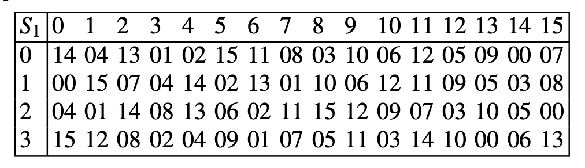

# Book Questions - Chapter 3
## S-Box
**How to calculate the $S_1(010101)$ ?** \
The first and last bits determine the row $(01)_2$ or $(1)_{10}$. \
The middle 4 bits determine the column number  $(1010)_2$ or $(5)_{10}$.

lookup in the $S_1$ table, for row 1 and column 5, the result is $(02)_{10}$ or $(0010)_{2}$

---
> **Question 1**

3.1. As stated in Sect. 3.5.2, one important property which makes DES secure is that
the S-boxes are nonlinear. In this problem we verify this property by computing the
output of $S_1$ for several pairs of inputs.
Show that $S_1(x_1) \oplus S_1(x_2) \neq S1(x_1 \oplus x_2)$ where "$\oplus$" denotes bitwise XOR, for:
1. $x_1 = 000000, x_2 = 000001$

$S_1(000000) = (14)_{10} = (1110)_{2}$ \
$S_1(000001) = (00)_{10} = (0000)_{2}$ \
$1110 \oplus 0000 = 1110$ then $S_1(000000) \oplus S_1(000001) = 1110$ \
while $000000 \oplus 000001 = 000001$ and $S_1(000001) = (00)_{10} = (0000)_{2}$ \
then  $S_1(000000) \oplus S_1(000001) \neq S1(000000 \oplus 000001)$

1. $x_1 = 111111, x_2 = 010101$
$S_1(111111) = (13)_{10} = (1101)_{2}$ \
$S_1(010101) = (12)_{10} = (1100)_{2}$ \
$1101 \oplus 1100 = 0001$ then $S_1(111111) \oplus S_1(010101) = 0001$ \
while $111111 \oplus 010101 = 101010$ and $S_1(101010) = (13)_{10} = (1101)_{2}$ \
then $S_1(111111) \oplus S_1(010101) \neq S1(111111 \oplus 010101)$

2. $x_1 = 101010, x_2 = 100000$

---

> **Chapter 3 - Question 2**

---
> For more questions email: nagy@aast.edu
